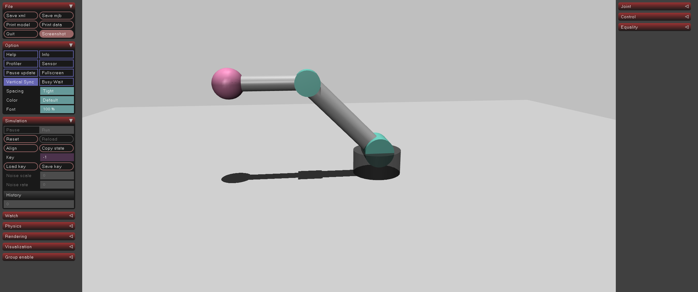

# 01-robotarm-mjdata: 로봇의 현재 상태(mjData) 확인하기

## 프로젝트 설명

geom으로만 구성한 2축 로봇을 사용해, MuJoCo의 mjData로 로봇의 현재 상태를 읽어 오는 예제입니다. 베이스 → 1축(어깨, hinge) → 2축(팔꿈치, hinge) → 손 끝 구조이며, 링크는 모두 capsule·cylinder·sphere geom으로 표현했습니다. 이후 관절·모터 제어와 기구학 예제의 기반이 됩니다.

## 실행 방법

```bash
uv sync
uv run python main.py
```

## 실행 결과

터미널에 관절 각도 `qpos`, 관절 속도 `qvel`, 손끝 월드 좌표가 1초 간격으로 출력되고, MuJoCo 뷰어가 열려 2축 로봇이 중력에 의해 기울어지는 모습이 보입니다.

```text
[t=  0.00] qpos=[0.000, 0.087] qvel=[0.000, 0.000] ee=(-0.026, 0.000, 0.799)
[t=  2.00] qpos=[0.429, 0.261] qvel=[0.716, 0.215] ee=(-0.355, 0.000, 0.697)
[t=  4.01] qpos=[0.786, 0.788] qvel=[-0.000, 0.000] ee=(-0.583, 0.000, 0.382)
```


