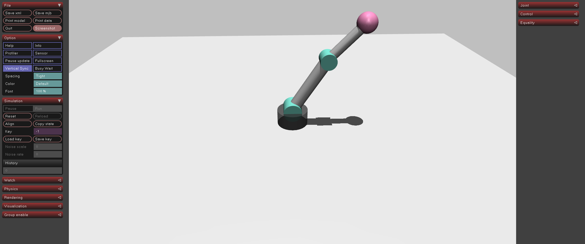

# 02-robotarm-control: 관절(Joint)과 모터 제어의 기초

## 프로젝트 설명

01에서 중력에 의해 쓰러진 ㄱ자 자세(+45°, +45°)를 시작점으로, motor actuator와 PD 제어로 팔을 들어올리고 왕복시킨 뒤 놓아 보는 예제입니다. `data.ctrl[i]`에 넣는 값이 곧 관절 토크(Nm)이며, PD 제어는 `τ = Kp·(목표 − 현재) + Kd·(0 − 속도)`로 토크를 계산합니다.

| 단계 | 시간 | 제어 | 동작 |
|---|---|---|---|
| 1 | 0 ~ 4 s | PD 제어 (목표 0°) | ㄱ자에서 수직으로 들어올리기 |
| 2 | 4 ~ 8 s | PD + 사인파 목표 | 0° 근처 왕복 운동 |
| 3 | 8 ~ 11 s | 토크 제거 (ctrl=0) | 중력에 의해 반대쪽 ㄱ자로 낙하 |

## 실행 방법

```bash
uv sync
uv run python main.py
```

## 실행 결과

단계 전환 시 구분선이 출력되고, 0.5초 간격으로 관절 각도 `q`, FK로 계산한 손끝 좌표, MuJoCo가 계산한 실제 좌표 `xpos`, 두 값의 거리 오차 `err`가 출력됩니다. 오차는 `10^-3` 수준으로 유지되어 FK 계산이 시뮬레이션과 일치함을 보여 줍니다.

```text
============================================================
  단계 1: PD 제어 → ㄱ자→수직 수렴 + FK 검증
============================================================
  [t= 0.01s] q=( +45.0, +44.9)°  FK=(-0.583,+0.383)  xpos=(-0.583,+0.382)  err=0.0014
  [t= 2.01s] q=(  +8.2,  +3.7)°  FK=(-0.119,+0.790)  xpos=(-0.119,+0.789)  err=0.0005
```

MuJoCo 뷰어에서는 로봇이 오른쪽 ㄱ자 → 수직 → 왕복 → 왼쪽 ㄱ자로 넘어가는 모습이 보입니다.


