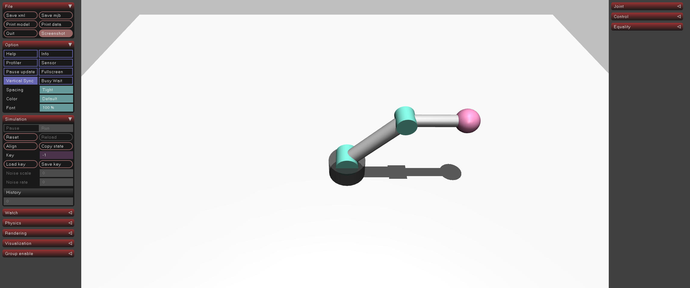

# 03-robotarm-kinematics: 순운동학(FK)으로 손끝 좌표 계산

## 프로젝트 설명

02에서 배운 PD 제어로 로봇을 움직이면서, 순운동학(Forward Kinematics, FK)으로 손끝 좌표를 직접 계산하고 MuJoCo가 알려 주는 `xpos`와 비교·검증하는 예제입니다. 관절 각도 `(q1, q2)`를 손끝 좌표 `(x, z)`로 바꾸는 수식을 사용하며, 링크 길이는 `scene.xml`의 body 위치와 같은 `L1 = 0.4`, `L2 = 0.3`입니다.

| 단계 | 시간 | 제어 | 동작 |
|---|---|---|---|
| 1 | 0 ~ 4 s | PD 제어 (목표 0°) | ㄱ자→수직 수렴 + FK 검증 |
| 2 | 4 ~ 8 s | PD + 사인파 목표 | 왕복 운동 + FK 추적 |
| 3 | 8 ~ 11 s | 토크 제거 (ctrl=0) | 중력 낙하 + FK 추적 |

## 실행 방법

```bash
uv sync
uv run python main.py
```

## 실행 결과

시작 시 초기 FK 검증이 출력되고, 이후 0.5초 간격으로 FK 좌표와 MuJoCo `xpos`를 비교합니다. 세 단계 모두에서 거리 오차 `err`가 `10^-3` 수준으로 유지됩니다.

```text
초기 FK 검증: q=(45.0°, 45.1°) → FK=(-0.583, 0.382)
  xpos: (-0.583, 0.382)  err=0.0000

============================================================
  단계 1: PD 제어 → ㄱ자→수직 수렴 + FK 검증
============================================================
  [t= 0.50s] q=( +29.6, +22.9)°  FK=(-0.435,+0.631)  xpos=(-0.437,+0.629)  err=0.0023
```

MuJoCo 뷰어에서는 로봇이 ㄱ자 → 수직 수렴 → 왕복 → 낙하하는 모습이 보입니다.


