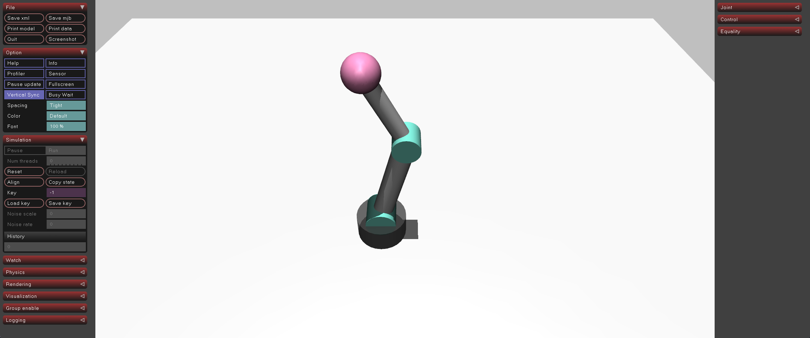

# 04-robotarm-ik: 역운동학(IK)으로 좌표 기반 이동

## 프로젝트 설명

03에서 배운 순운동학(FK)의 역연산인 역운동학(Inverse Kinematics, IK)으로 목표 좌표 `(x, z)`를 관절 각도 `(q1, q2)`로 바꾸고, 그 각도를 PD 제어로 추종하는 예제입니다. 관절 범위는 `scene.xml`과 동일한 joint1·joint2 각각 ±45°이며, 링크 길이는 03과 같습니다.

목표 좌표는 두 관절이 모두 굽어야 닿는 `(-0.05, 0.76)`으로 잡았습니다. 수직으로 곧게 편 `(0, 0.8)`은 IK 해가 `(0°, 0°)`이라 03의 PD 예제와 결과가 같아 IK의 역할이 드러나지 않기 때문입니다.

## 실행 방법

```bash
uv sync
uv run python main.py
```

## 실행 결과

시작 시 IK로 계산한 관절 목표가 출력됩니다. 같은 좌표에 대해 elbow 위·아래 두 해가 모두 관절 범위 안에 있으며, 현재 자세(seed)에 가까운 해가 선택됩니다. 이후 0.5초 간격으로 목표 좌표와 실제 손끝 위치 `xpos`, 거리 오차 `pos_err`가 출력됩니다.

```text
IK 목표=(-0.050, 0.760)
  q=(-12.0°, 38.4°)

============================================================
  단계 1: IK 목표 (-0.05, 0.76) 굽힌 자세로 수렴
============================================================
[t= 0.0s] 목표=(-0.050,0.760)  q=( +45.0, +45.1)°  xpos=(-0.583,+0.382)  pos_err=0.6538
[t= 4.0s] 목표=(-0.050,0.760)  q=( -13.1, +41.2)°  xpos=(-0.050,+0.754)  pos_err=0.0057
[t= 9.6s] 목표=(-0.050,0.760)  q=( -14.5, +40.9)°  xpos=(-0.033,+0.756)  pos_err=0.0175
```

`pos_err`가 0으로 수렴하지 않고 약 0.017 m에서 머무는 것은 PD 제어에 중력 보상이 없어 중력 토크와 P 항이 균형을 이루기 때문이며, IK 계산 오차가 아닙니다. MuJoCo 뷰어에서는 로봇이 목표 좌표를 향해 이동하는 모습이 보입니다.


