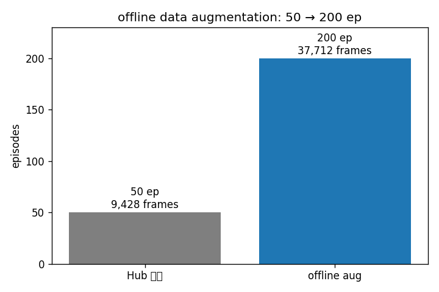

# 01-data-augment: offline 데이터 증강

## 프로젝트 설명

Hub의 50 ep 데모 데이터를 offline 데이터 증강(offline data augmentation)으로 200 ep로 확장하는 예제입니다. top·side 카메라 이미지에 ColorJitter를 적용하고 action·state 궤적은 원본을 그대로 유지합니다. (Python 3.12 / LeRobot 0.6.0)

```text
Hub 50ep → augment_dataset.py → local 200ep → (02) train · eval · compare
```

- [augment_dataset.py](augment_dataset.py) — Hub 다운로드 + ColorJitter 증강 + 로컬 저장

원본은 `makepluscode/so_arm101_block_picking_main`(50 ep, 9,428 frames)이고, 출력은 원본에 ColorJitter 사본 3벌을 더한 200 ep, 37,712 frames입니다. ColorJitter의 brightness·contrast·saturation은 모두 0.05이며 GaussianBlur는 쓰지 않습니다.

## 실행 방법

```bash
uv sync
uv run python augment_dataset.py
```

## 무엇이 출력되나

에피소드마다 증강 사본 생성 로그가 나오고, `datasets/local/so_arm101_block_picking_aug200/`에 저장됩니다. RTX 3060 12GB 기준 십수 분 걸립니다.

스크립트 종료 시 출력되는 에피소드·프레임 수가 **200 ep, 37,712 frames**이면 정상입니다. 이 예제는 `torch.manual_seed`로 난수를 고정하므로 몇 번을 실행해도 이 수치가 같습니다. 이어지는 학습·평가는 [`02-train-eval`](../02-train-eval/)에서 진행합니다.


